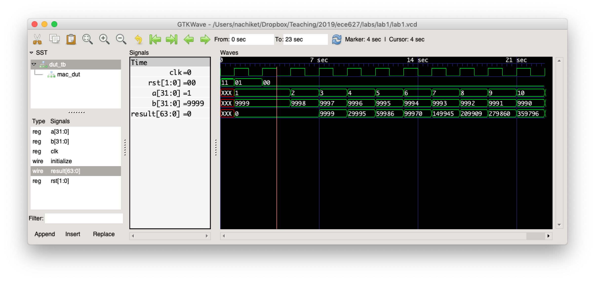
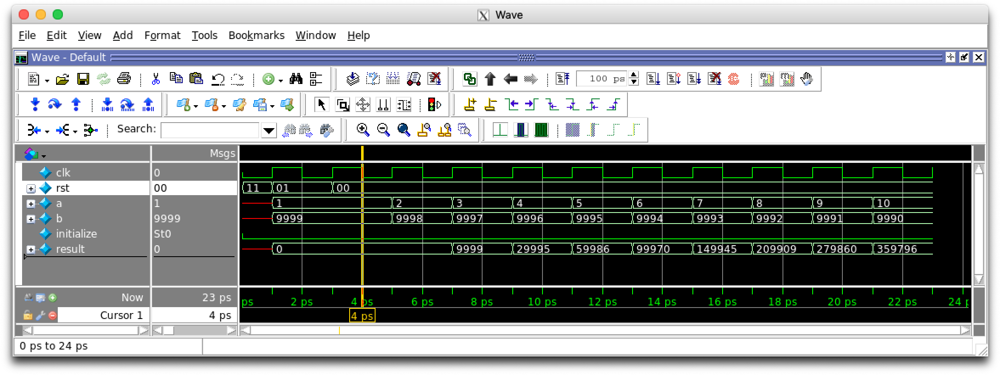
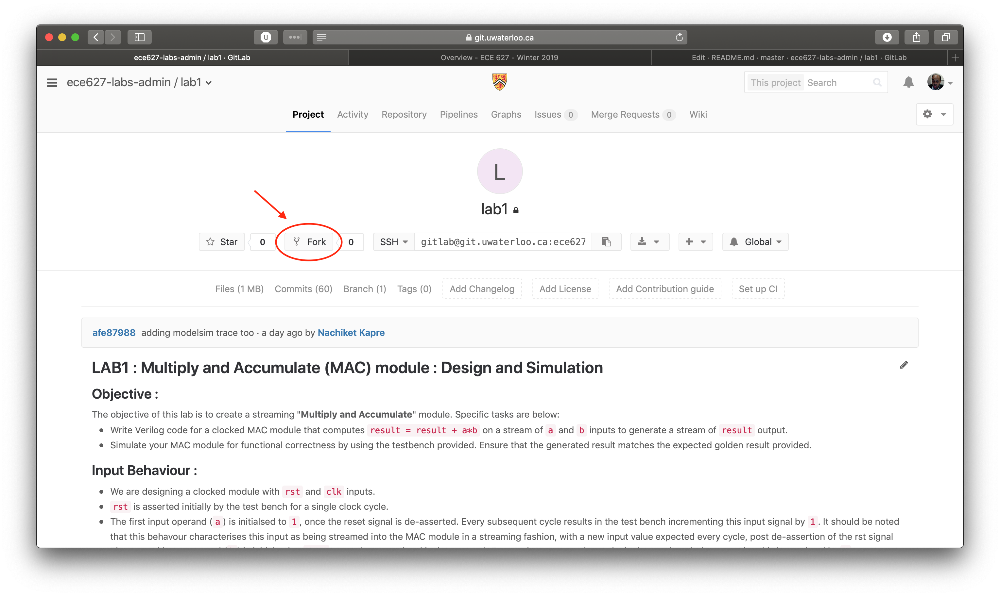

# LAB1 : Multiply and Accumulate (MAC) module : Design and Simulation

## Objective :

The objective of this lab is to create a streaming "**Multiply and Accumulate**" module. Specific tasks are below:

* Write Verilog code for a clocked MAC module that computes `result = result + a*b` on a stream of `a` and `b` inputs to generate a stream of `result` output.
* Simulate your MAC module for functional correctness by using the testbench provided. Ensure that the generated result matches the expected golden result provided.

## Input Behaviour :

* We are designing a clocked module with `rst` and `clk` inputs.
* `rst` is asserted initially by the test bench for a single clock cycle.
* The first input operand (`a`) is initialsed to `1`, once the reset signal is de-asserted. Every subsequent cycle results in the test bench incrementing this input signal by `1`.
It should be noted that this behavour characterises this input as being streamed into the MAC module in a streaming fashion, with a new input value expected every cycle, post de-assertion of the rst signal
* The second input operand (`b`) is initialsed to `9999`, once the reset signal is de-asserted. Every subsequent cycle results in the test bench decrementing this input signal by `1`.
* The `initialize` signal resets the value of `result` to zero.

## Output Behaviour :

* Once the reset signal is de-assered, the output `result` should be observed after a fixed latency of 2 cycles. Since the inputs stream in every cycle,
 the output signal is expected to change accordingly. Hence, the latency of the output should be 2 cycles and the throughput should be 1. We will study this terminology in greater detail in the Pipelining lecture.
* The MAC unit output is reset after a delay of 2 cycles following the assertion of `initialize` signal.

### The images below capture the expected correct waveform : 




The text trace below is the output of $display statements and captures the same
information as the waveforms above:

```
# Time=5,a=2,b=9998,result=0
# Time=7,a=3,b=9997,result=9999
# Time=9,a=4,b=9996,result=29995
# Time=11,a=5,b=9995,result=59986
# Time=13,a=6,b=9994,result=99970
# Time=15,a=7,b=9993,result=149945
# Time=17,a=8,b=9992,result=209909
# Time=19,a=9,b=9991,result=279860
# Time=21,a=10,b=9990,result=359796
```

## Creating your design : 

Update the file called `mac.v` already provided in the repository. The following should be the I/O ports of the module :

1. `clk` : 1 bit input : This is the clock input
2. `rst` : 1 bit input : This is a synchronous active high reset 
3. `a` : D_W bits input : This is the first streaming input.
3. `b` : D_W bits input : This is the second streaming input.
4. `initialize` : 1 bit input : This instructs the accumulator to reset.
5. `result` : 2*D_W bits output : This is the output of the MAC module. 

The data width (D_W) should be parameterised with a `parameter` declaration.
Check the `dut_tb.v` test bench for an example of how to declare a parameter. We
assume that the generated result is of a larger precision of 2*D_W than the
inputs to account for storage requirements of product and resulting accumulated
number.

## Testing your design : 

As with all labs, you have to use `jane.uwaterloo.ca` or
`deathstar.eng.uwaterloo.ca` for your lab work.

To compile and simulate test your module, simply type `make modelsim`. Modelsim
will start in GUI mode.

If you prefer iverilog and gtkwave (OSS tools), you can use `make iverilog`
instead.

## Submitting your solution

First off, you will need to **fork** this repository into your own space. 



Then you clone it the *forked* copy of the git repository onto your computer.

```
git clone gitlab@git.uwaterloo.ca:<username>/ece627-lab1.git
```

You can then fill in your solution code in `mac.v` and ensure that the test output matches the waveforms shown above.

You can commit your design in two steps:
```
git commit -a -m "solution is ready for grading"
git push origin master
```

If you are unsure about these steps using `git` please email me or come chat 3:30-4:30pm on Tuesday 29th 2019.
